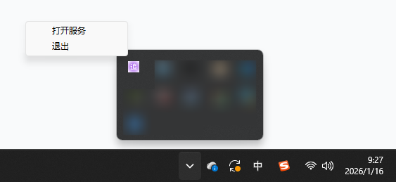
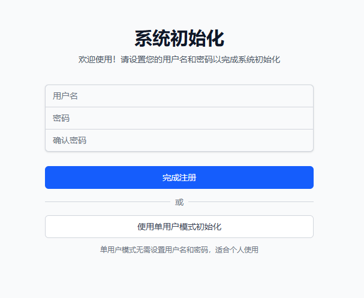

# tvsurf - 网上冲浪追番追剧小助手
还在为网上找不到视频资源而苦恼？还在为找到的视频资源总有奇怪的广告而愤怒？还在为在网站上看完视频忘记看到哪而崩溃？试试tvsurf，网上冲浪，追番追剧小助手。

# 功能展示
在互联网上搜索资源，动画，电视剧，电影，综艺均可搜索下载(悄悄告诉你，下载时做了去广告处理)


在线看番，可以支持播放进度记忆功能，不用再为不知道播放到哪里而崩溃了


自动追更，自动获取番剧最新更新。播放列表，管理所有的番剧状态。还有更多功能等你探索。

# 快速开始

## Windows
访问 [github release](https://github.com/codewdy/tvsurf/releases) 来获取最新版本。

双击打开 tvsurf.exe，稍微等待一段时间，即可看到弹出的网页，同时在系统托盘处，也可以找到对应的图标。

注意：由于Windows Defender会进行扫描，所以第一次启动程序的时候会比较慢，可能需要几分钟，第二次之后就会好转。





通常来说，对于 windows 用户，使用单用户模式足够便捷，默认的不对外服务，也可以保护你的隐私不被网络上其他人获取。

### 配置

注意，数据默认存储于和tvsurf.exe同目录下的data文件夹，如果你需要自己配置，可以修改config.yaml。

```
# 数据目录，如果是相对路径，将根据配置文件的目录作为基准
data_dir: 'data'
# 服务端口
port: 9399
# local: 本地服务, 只服务本机，不对外开放端口; online: 在线服务，对外开放端口
server_type: local
```


## NAS or Linux with Docker
一句话执行：

```
export DATA_DIR=/path/to/data-dir
export PORT=9399
docker run -d --user $(id -u ${USER}):$(id -g ${USER}) -v ${DATA_DIR}:/app/tvsurf/data -p ${PORT}:9399 -ti ghcr.io/codewdy/tvsurf:latest
# 如果上面的太慢，也可以选择国内的镜像站：
# docker run -d --user $(id -u ${USER}):$(id -g ${USER}) -v ${DATA_DIR}:/app/tvsurf/data -p ${PORT}:9399 -ti ghcr.nju.edu.cn/codewdy/tvsurf:latest
 ```

或者使用 docker compose，创建 `docker-compose.yml` 文件：

```yaml
version: '3.8'

services:
  tvsurf:
    image: ghcr.io/codewdy/tvsurf:latest
    # 如果上面的镜像太慢，也可以选择国内的镜像站：
    # image: ghcr.nju.edu.cn/codewdy/tvsurf:latest

    container_name: tvsurf
    # 设置容器运行的用户ID和组ID，确保文件权限正确
    # 在 NAS 系统中，通常需要设置为 NAS 管理员的 UID/GID
    # 可以通过 SSH 登录 NAS 后执行 id 命令查看，或者查看 NAS 管理界面中的用户信息
    # 例如：user: "1000:1000" 或 user: "${UID}:${GID}"
    user: "${UID}:${GID}"
    # 修改 /path/to/data-dir 到你像保存的数据文件夹
    volumes:
      - /path/to/data-dir:/app/tvsurf/data
    # 修改第一个 9399 为你希望启动服务的端口
    ports:
      - "9399:9399"
    restart: unless-stopped
```

然后执行：

```
# 在 Linux 系统中，自动获取当前用户的 UID 和 GID
export UID=$(id -u)
export GID=$(id -g)
docker compose up -d
```

这将启动一个后台 docker 进程，在 9399 端口启动服务，把数据存储在 /path/to/data-dir 目录里。

此时访问对应的端口，应该会弹出如下界面：


推荐使用用户名密码模式，因为很多 nas 可能会对外网暴露数据，使用单用户模式将把所有信息不加密地暴露在外网上。


## Linux without Docker
访问 [github release](https://github.com/codewdy/tvsurf/releases) 来获取最新版本。

对于 Ubuntu，你需要安装以下依赖：

```
apt-get install libxcb1 libdrm-dev libnss3 fontconfig fonts-dejavu-core
```

这些依赖主要是由于我们的爬虫需要执行chrome，这是chrome的一些依赖文件。

然后修改 tvsurf 里面的 config.yaml，修改为你喜欢的样子，或者也可以在其他地方新建一份 config.yaml。

最后执行

```
# 也可以不用 --config，默认会在可执行文件的同目录下搜索 config.yaml
tvsurf/tvsurf --config /path/to/config.yaml
```

# 安全声明
请 ** 不要 ** 用这个工具搭建互联网服务，我也特意没有开发“注册”接口。

如果有人使用这个工具牟利，我对此产生的一切后果概不负责。